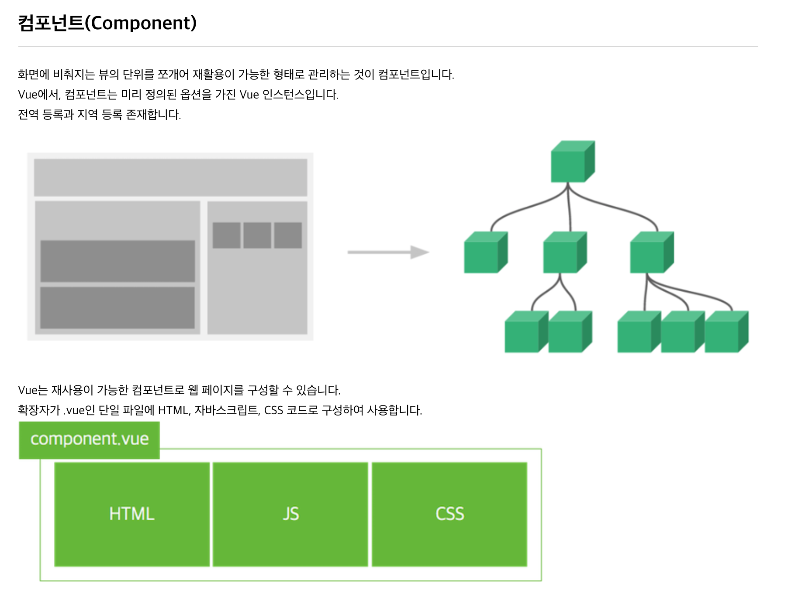

# Application 프로젝트 템플릿
> Demo frontend 는 vuejs로 개발되어 있으며, Vue 내용을 참조하여 개발자가 구현하도록 가이드 한다.

## 1. Vuejs 란?
> Evan You가 만들었으며, 2014년 릴리즈를 시작으로 꾸준히 발전하고 있는 자바스크립트 프레임워크입니다. 
> 컨트롤러 대신 뷰 모델을 가지는 MVVM(Model-View-ViewModel) 패턴을 기반으로 디자인되었으며, 
> 재사용이 가능한 UI들을 묶어서 사용할 수 있습니다.
>>- MVVM 패턴

## 2. Vuejs 구성
