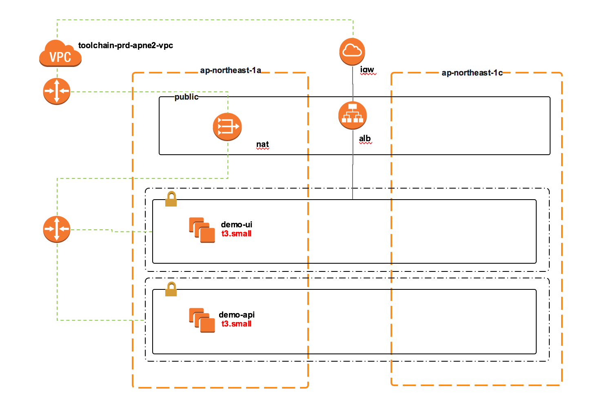

## Infra Architecture

### 인프라 아키텍처 도메인

인프라 리소스 구분| 환경 및 서비스 모듈 | 
------------ | -------------- | 
시스템 구분     | toolchain      | 
리전          | apne2          | 
Environment  | prd            | 
서비스 모듈     | demo-app       | 

### 인프라 아키텍처 논리 모델

demo-frontend 서비스 출시를 위해선 vpc, alb, subnet등 AWS 콘솔에서 필요한 리소스를 사전에 구성 하여야 합니다.
해당 리소스의 구성은 [VPC 리소스 구성](/iac/infra-02) 을 참고 합니다.
