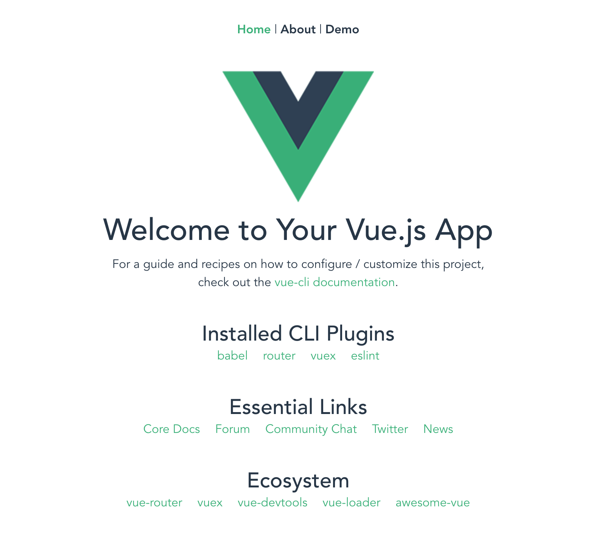
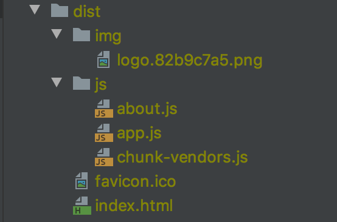

# **Vuejs 공유**
---
## 1. Vue 프로젝트 모듈 설치
> - 프로젝트 package.json에 정의되어 있는 node_moules 을 설치한다.  
> - 프로젝트 clone 이후 최초 1회, 단 package.json 변경이 있는 경우 재 실행 필요.
~~~
$ cd ~/workspace/frontend-demo
$ npm install
~~~

## 2. vue 로컬 서버 실행
> - npm module 이  정상적으로 설치되어 있는 경우 실행 가능
~~~
$ cd ~/workspace/frontend-demo
$ npm run serve
~~~

## 3. vue build
> - npm module 이  정상적으로 설치되어 있는 경우 빌드 가능 
> - html 파일로 실행 가능하여 서버 배포시 사용
> - 명령어 실행 후 dist 폴더에 빌드 결과 확인 가능
~~~
$ cd ~/workspace/frontend-demo
$ npm run build
~~~

