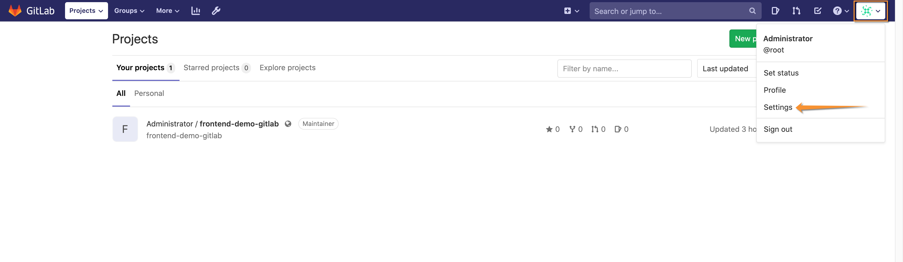
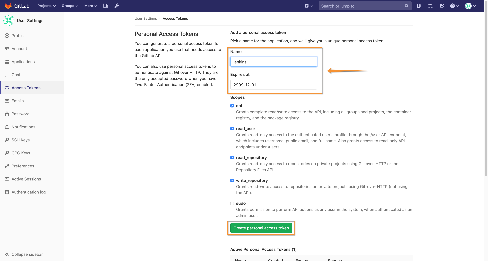
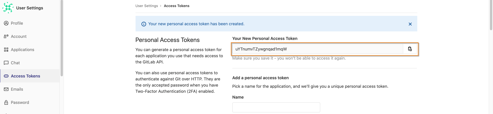
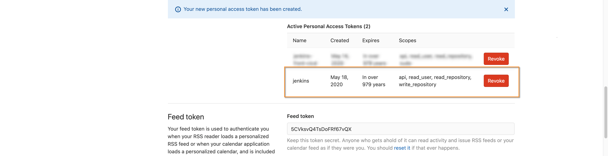
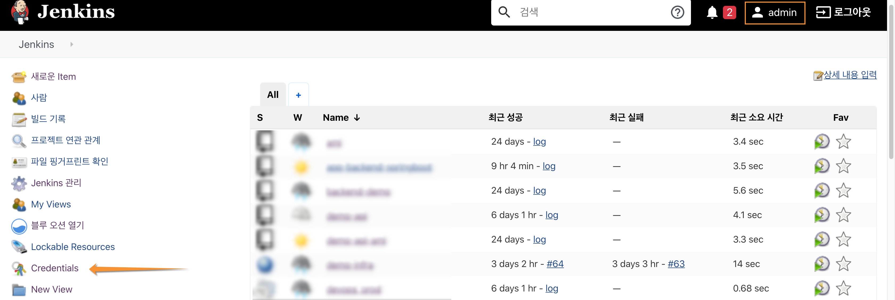
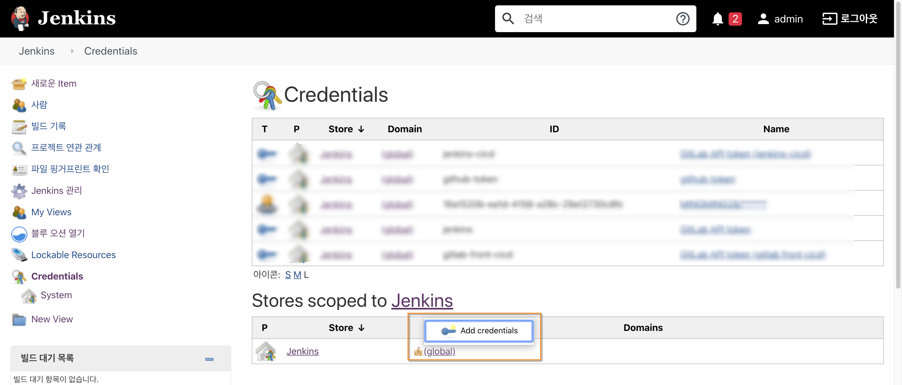
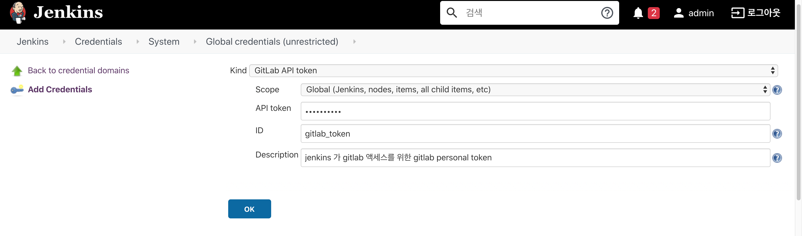
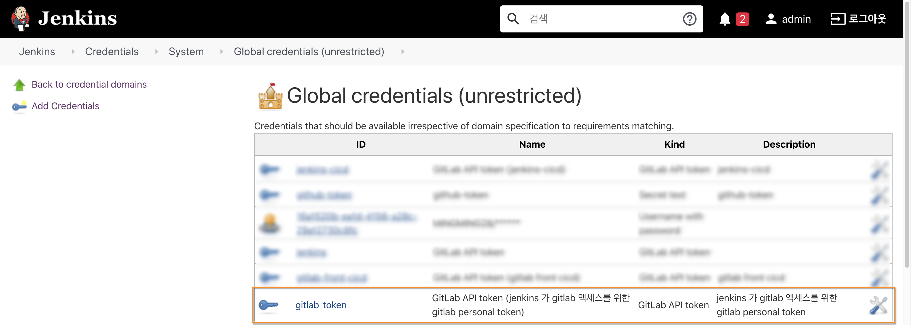
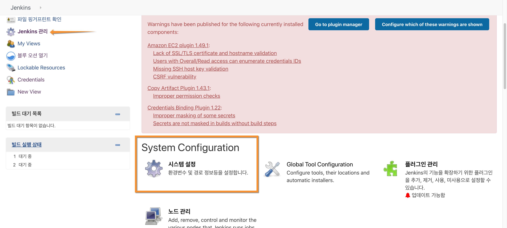
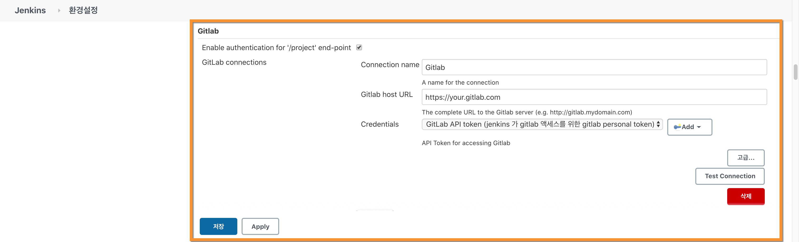

# Gitlab Jenkins 인증 구성

## 1. GitLab 토큰 생성

Gitlab Administrator 사용자로 로그인 하고 작업을 진행 합니다.

- 상단 로그인 툴팁의 "Settings" 메뉴를 시작으로 Access Token을 생성을 시작합니다.

 

- 좌측 "Access Tokens" 메뉴를 클릭하고 Token 네임, 만료일자, 액세스 범위를 선택하고 화면 하단의 "Create personal access token"을 클릭 합니다.

 

- 새롭게 생성된 Personal Access Token을 클립 보드에 복사대 둡니다. 이 토큰은 Jenkins가 Gitlab에 액세스할 때 사용 됩니다.

화면 하단엔 신규로 생성된 활성화된 토큰(예: jenkins)에 대한 정보가 표시 됩니다.

## 2. Jenkins Credentials 등록

Jenkins Administrator 사용자로 로그인 하고 작업을 진행 합니다.

- Jenkins 메인 화면의 "Credentials" 메뉴를 클릭 합니다.

 

- "Stores scoped to Jenkins" 에 (Global) 영역의 툴팁 메뉴를 통해 "Add Credentials"을 클릭 하고 Gitlab 토큰 정보를 등록 합니다.

 

- Gitlab Access Token 정보 등록
아래 화면과 같이 주요 정보를 입력 합니다. 특히, token 항목 값은 이전에 생성한 Gitlab Access Token 값을 기입 합니다.

 

- Gitlab Access Token 등록 결과 확인

위 화면과 같이 등록된 Gitlab Access Token 정보를 확인할 수 있습니다.

 

- Gitlab Connection 등록
Jenkins의 프로젝트가 Gitlab 서버에 액세스 하기 위해 공통 Endpoint를 등록 합니다.

 

- "Jenkins 관리"의 "시스템 설정"에서 아래와 같이 Gitlab의 커넥션 정보를 구성 할 수 있습니다.

