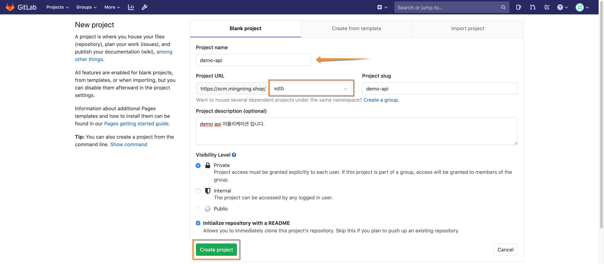
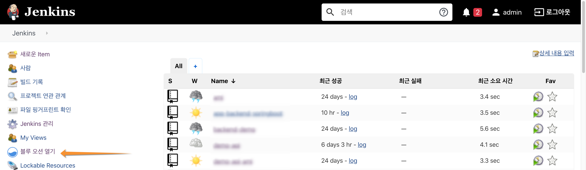
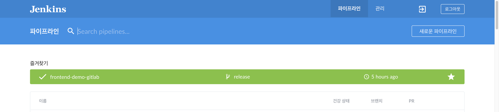
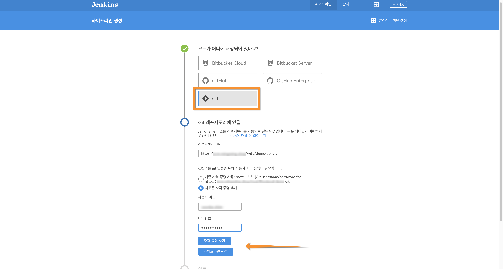
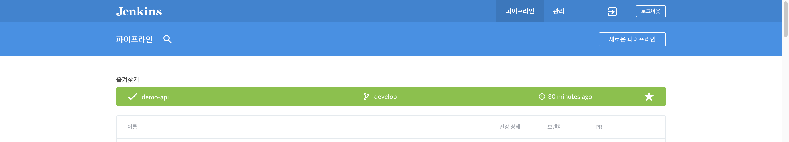

# Jenkins CICD 구성

## 1. gitlab 프로젝트 생성

- demo-frontend (가칭) 어플리케이션을 위한 gitlab 프로젝트를 생성 합니다.

프로젝트 이름, 그룹 or 사용자 선택, 프로젝트 slug, 설명, 액세스 레벨 등을 입력 하고 새로운 git 저장소를 생성 합니다.

 

- demo-frontend 어플리케이션에 대한 구현 결과물은 사전에 구성된 셋을 참고 하세요.

---

## 2. Jenkins CICD 파이프라인 생성

-  Jenkins 메인 화면 에서 "블루 오션 열기"를 선택 합니다. 

 

-  Blue Ocean 화면 에서 "새로운 파이프라인"을 선택 합니다. 

 

-  애플리케이션을 위한 CICD 파이프라인을 구성 합니다. (예: demo-frontend) 

저장소를 "Git" 으로 선택 하고, 기존 인증 정보가 없다면 "자격증명추가"를 선택하고 demo-frontend 저장소를 액세스 할 수 있는 인증 정보를 기입 합니다.  
demo-frontend 어플리케이션엔 "Jenkinsfile" 이 존재 하므로 자동적으로 파이프라인이 구성 됩니다.      
참고로, gitlab 서버에 "jenkins-cicd" 와 같은 사용자를 사전에 생성 하는것을 추천 합니다. Jenkinsfile을 사전에 구성하지 않았다면 "파이프라인 생성"을 통해 GUI에서 구성이 가능 합니다.

 

- demo-frontend 파이프라인이 아래와 같이 구성됨을 확인할 수 있습니다.

