# Jenkins Webhook 구성

## 1. Jenkins 자동 배포 브랜치 설정
Jenkins의 demo-frontend 파이프라인의 Configuration 을 통해 GitOps 자동 배포를 구성 합니다. 

-  demo-frontend Jenkins 프로젝트에서 Configure를 선택 합니다. 
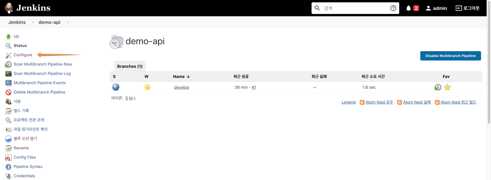

 

-  "Branch Sources" 섹션에서 Behaviours 중 "Filter by name (with wildcards)를 선택 합니다.
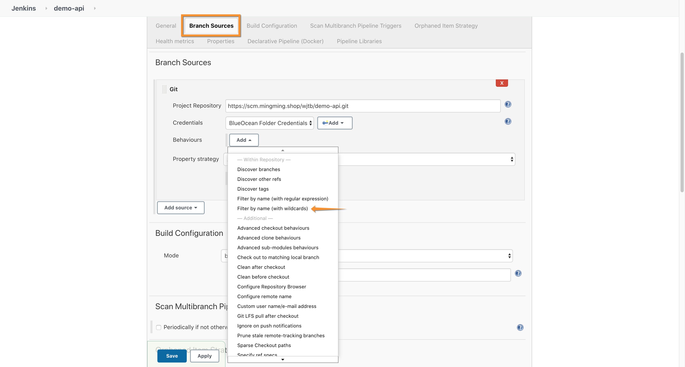

 

- Include 에 자동 배포가 되는 기준 브랜치 (develop release master) 브랜치를 기입 하고, 
Exclude 에 자동 배포가 제외될 브랜치 (feature)를 기입 합니다.  
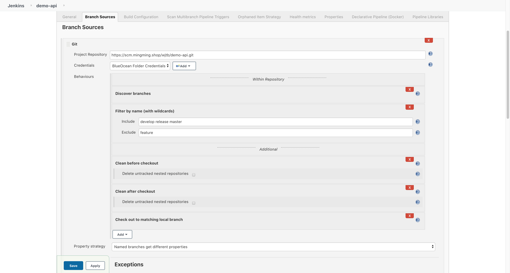

 

- 자동 배포 브랜치 참조 속성 전략(Property strategy) 를 "Named branches get different properties"로 선택 하고 브랜치별 환경 변수를 다르게 지정 가능하도록 합니다.  
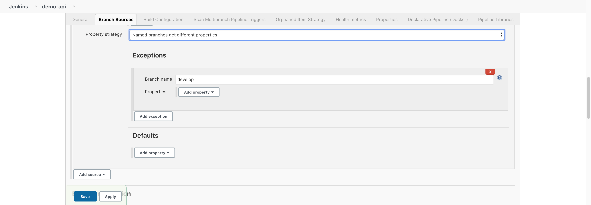

 

- "Build Configuration"에서 CICD 파이프 라인 설정을 Jenkinsfile 로 지정 합니다.  
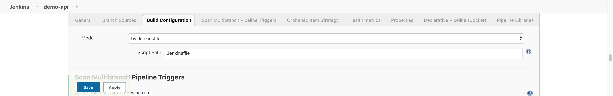

---

## 2. Jenkins Webhook URI 확인

- Jenkins 의 demo-frontend 파이프라인의 develop 브랜치를 선택 합니다.   
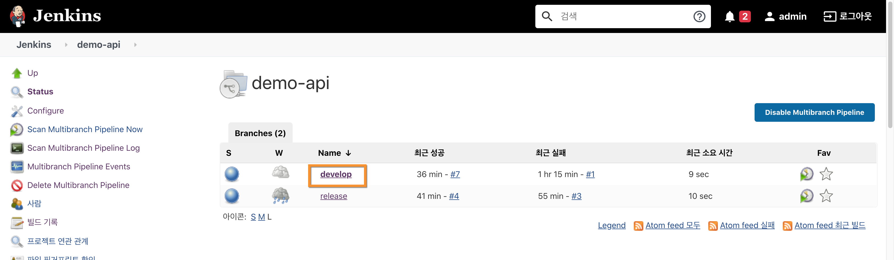

 

- View Configuration을 선택 합니다.   
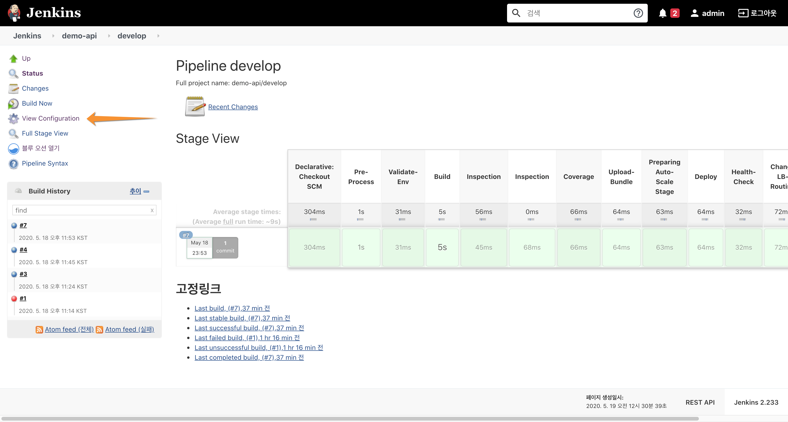

 

- "Build Triggers" 섹션의 "Build when a change is pushed to GitLab. GitLab webhook URL" 항목에 있는 주소를 클립 보드에 복사하였다가 Gitlab 프로젝트의 Webhooks 로 등록 한다.
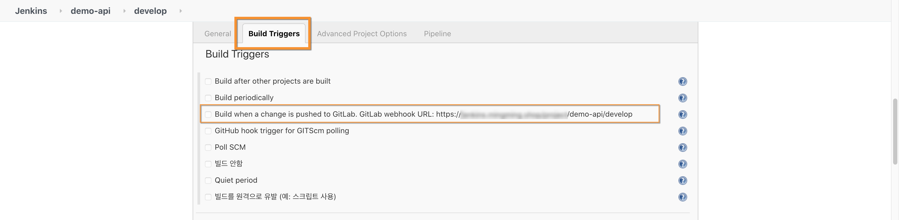

 

---

## 3. Gitlab Webhooks 등록
앞서 Jenkins의 Webhook 주소를 gitlab 프로젝트(demo-frontend)의 Webhooks에 등록 합니다.

- Gitlab의 demo-frontend 프로젝트를 선택 하고 "Settings > Webhooks" 메뉴를 선택 합니다.  
다음으로, Jenkins WebHook 주소를 URL에 기입하고 Push events 를 선택 한 뒤 하단의 "Add webhook" 을 통해 등록 합니다.
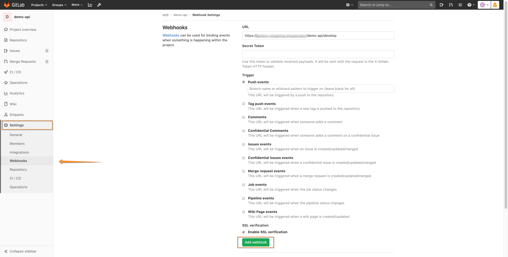

 

- 등록된 Webhook은 "Test" 버튼을 통해 hook 기능이 정상 동작 하는지 확인 할 수 있습니다. 
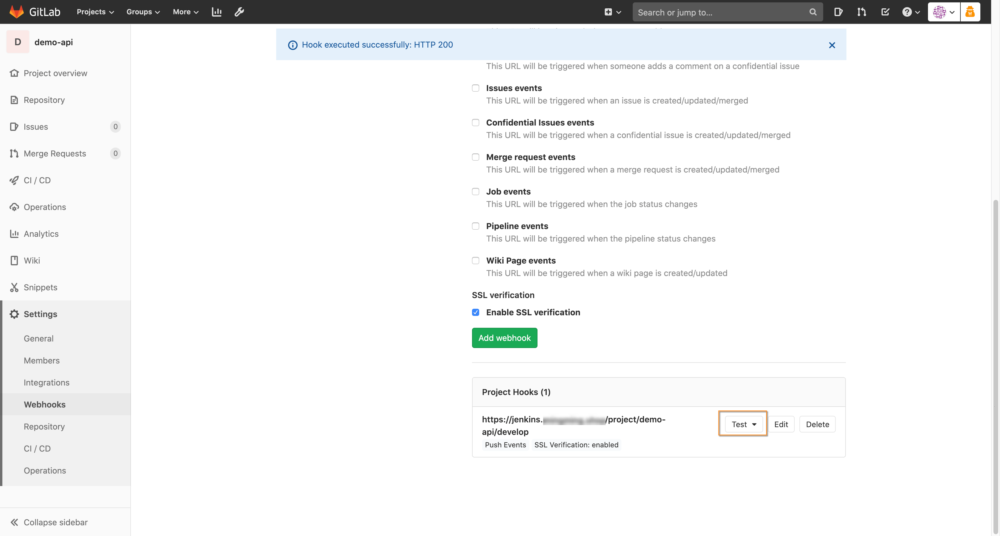

 

- webhook 이 정상 동작 한다면 화면 상단에 HTTP 200 과 같은 정상 메시지를 확인 할 수 있습니다.
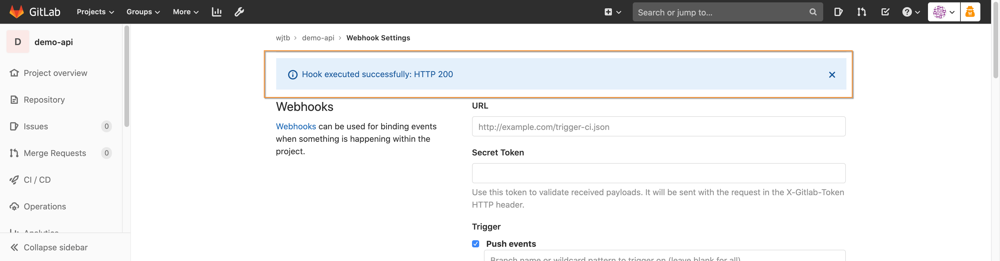

