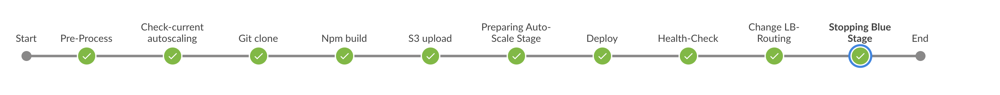

# CICD 상세 흐름

## demo-frontend CICD 파이프라인 상세 


````js
pipeline {
    agent any
    stages {
        stage('Pre-Process') {
            사전 준비 단계로 배포에 필요한 변수값 셋팅한다. (blue, green 사용 변수)
        }

        stage('Preparing Auto-Scale Stage') {
            현재 사용중인 auto-scaling instance 갯수를 판단하여 변수값 셋팅한다.(배포시 활용)
        }
        
        stage('Git clone') {
            GitLab에서 frontend 프로젝트 clone 받는다.
        }
        
        stage ('Npm build') {
            git에서 받은 frontend 프로젝트 배포 파일을 생성한다.
        }
        
        stage ('S3 upload') {
            frontend 프로젝트 배포 파일을 zip 파일로 변경하여, S3에 저장한다.
        }
        
        stage('Preparing Auto-Scale Stage') {
            blue 가 사용인 경우 green Auto-scaling group을 최소 단위로 활성화 시킨다.
        }
        
        stage('Deploy') {
            AWS CodeDeploy를 실행하여, green에 frontend 를 배포한다.
        }
        
        stage('Health-Check') {
            AWS CodeDeploy 배포 완료를 기다린다.
        }
        
        stage('Change LB-Routing') {
            ALB에 맵핑되어 있는 blue와 green 의 target group을 변경하여 새로 배포돠어 있는 green을 사용가능하게 한다.
        }
        
        stage('Stopping Blue Stage') {
            기존에 사용중인 blue 영역을 정지시킨다.
        }
    }
}
````