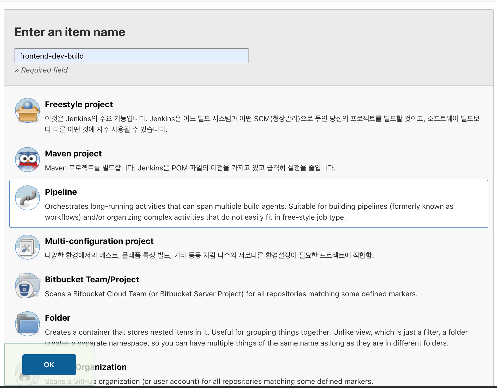
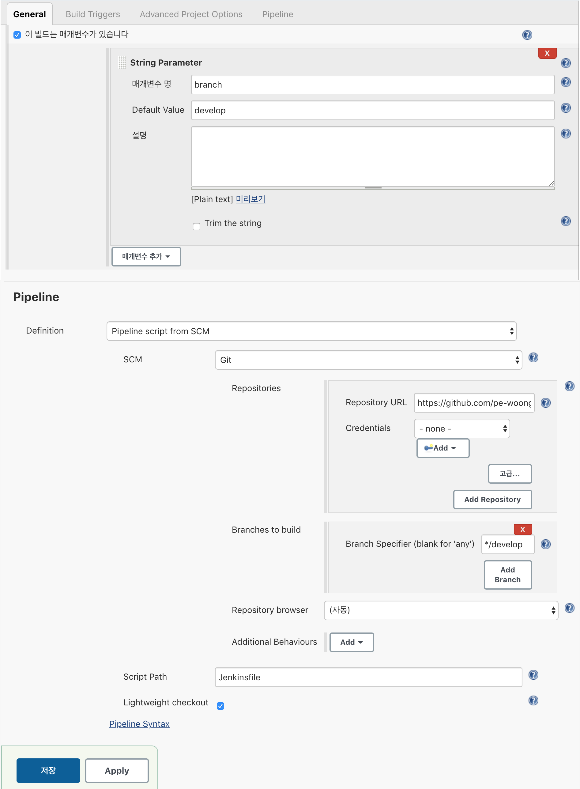
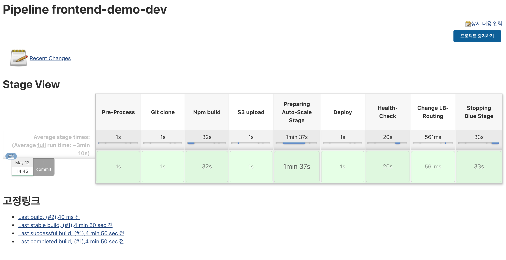

# **Jenkins 빌드**
---
## 1. Jenkins Pipeline 만들기
### 1) Jenkins Pipeline 이란?
> Jenkins Pipeline 이란 Jenkins 2 부터 정식으로 도입 되었으며, continuous delivery 흐름을 스크립트로 정의하고 실행 할 수 있도록 하는 기능 입니다.  
> 스크립트는 groovy DSL로 작성되며 이는 Jenkinsfile 이라 부르는 텍스트파일로 작성될 수 있고 이 파일은 source repository에 포함되어 Jenkins에 의해 실행 될 수 있습니다. 
> continuous delivery 흐름을 스크립트 파일로 정의한다는 것은 DevOps 관점에서 큰 의미가 있습니다.  
> DevOps 에서 가장 중요하게 다루는 가치 중 하나가 인프라를 코드로서 정의하고 이를 통해 고도로 자동화된 운영환경을 구현하는 것에 있는데 Jenkins Pipeline 이 그러한 가치의 구현체 중 하나인 것 입니다.

### 2) JenkinsFile 생성
> - 설명 : Pipeline설정을 정의한 Groovy파일. 해당 파일에 Pipeline설정을 작성한다. 
> - 위치 : GitHub root 위치에 JenkinsFile 을 생성하여 사용한다. (/opsflex/ami/Jenkinsfile)

## 2. Jenkins Pipeline 설정방법
### 1) 관련 용어
> - pipeline : 파이프라인은 CD Pipeline 모델을 나타낸다. 해당 부분의 코드는 전체 빌드 프로세스를 정의한다. 일반적으로 빌드, 테스트, 배포 등의 Stage를 포함하는 형식이 된다. 
(선언적 파이프라인 형식으로, script를 사용하기 위해서는 scipt영역을 지정해야 함)
> - node : script 파이프라인 형식으로, script 키워드 없이 내부 스크립트 작성 가능
> - stage : 빌드, 테스트 등과 같은 개념적으로 분리된 Subset을 나타낸다.
> - step : Stage 내부에 위치하는 단일 Task를 의미한다. (ex. sh ‘make’)
> - script : groovy스크립트를 사용하는 경우 script scope 내에 작성
> - post : 파이프라인 실행이 종료된 이후의 작업 설정
> - triggers : 파이프라인 트리거 설정 (cron, pollSCM 등의 키워드로 설정함)

### 2) script 주요 명령어
> - sh : bash쉘에서 쉘 스크립트 실행 (ex. sh ‘gradlew test’)
> - bat : windows에서 쉘 스크립트 실행 (ex. bat ‘gradlew test’)
> - echo : 콘솔 출력
> - sleep : 슬립 (ex. sleep 30)
> - pwd : 현재 파일 디렉토리 경로 출력
> - try-catch문 사용가능

### 3) jenkins 화면
> - JenkinsFile 의 parameter와 jenkins화면의 parameter를 맞춰준다.
> - JenkinsFile 이 있는 프로젝트 GitHub 정보를 입력한다.

## 3. Jenkins Blue-Green 배포 방식
### 1) 배포 선행작업 
> - APP 프로젝트에 JenkinsFile 이 설정되어 있어야 한다.
> - Codedeploy 가 정상적으로 생성되어 있어야 된다.
> - Codedeploy 가 정상 수행 가능하도록 프로젝트에 appspec.yml이 정상적으로 설정되어 있어야 한다. 

### 2) JenkinsFile 배포 내용

> - Pre-Process
>> 사전 준비 단계로 배포에 필요한 변수값 셋팅한다. (blue, green 사용 변)
> - Git clone
>> Github에서 frontend 프로젝트 clone 받는다. 
> - Npm build
>> git에서 받은 frontend 프로젝트 배포 파일을 생성한다.
> - S3 upload
>> frontend 프로젝트 배포 파일을 zip 파일로 변경하여, S3에 저장한다.
> - Preparing Auto-Scale Stage
>> blue 가 사용인 경우 green Auto-scaling group을 최소 단위로 활성화 시킨다.
> - Deploy
>> AWS CodeDeploy를 실행하여, green에 frontend 를 배포한다.
> - Health-Check
>> AWS CodeDeploy 배포 완료를 기다린다.
> - Change LB-Routing
>> ALB에 맵핑되어 있는 blue와 green 의 target group을 변경하여 새로 배포돠어 있는 green을 사용가능하게 한다.
> - Stopping Blue Stage
>> 기존에 사용중인 blue 영역을 정지시킨다.