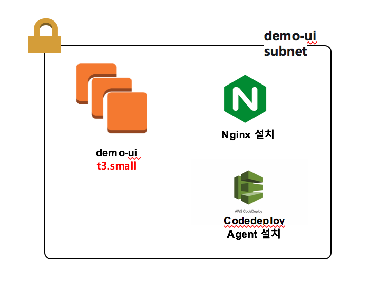

# 베이스 이미지 구성
> Demo frontend 가 정상적으로 실행 되기 위한 설정내용을 나타낸다.

## 1. 구성 화면

## 2. 설명
> base image는 amazon linux2를 기준으로 진행한다.
### 1) nginx 웹서버 설치
> - nginx 설치
~~~
$ sudo amazon-linux-extras enable nginx1.12
$ sudo amazon-linux-extras install nginx1.12=latest -y

~~~

> - nginx.conf 설정 변경 
~~~
$ cd /etc/nginx
$ vi nginx.conf
~~~
> 관리자 관리하고 싶은 디렉토리 위치로 변경 
> server에 root 위치 변경 -> /home/ec2-user/dist; 

> - cicd init health check 작업
>> 최초 aws auto scaling 인스턴스가 올라올때 기본 health check 작업을 위하여 index.html 파일 복사하여 80포트에서 정상적으로 실행되게 한다.
~~~
$ mkdir -p /home/ec2-user/dist
$ cp -r /usr/share/nginx/html/index.html /home/ec2-user/dist/index.html
~~~

> - 서버 재실행
~~~
$ sudo service nginax restart
~~~

### 2) code-deploy agent 설치
> - agent 설치
~~~
$ sudo yum update
$ sudo yum install ruby
$ sudo yum install wget
$ cd /home/ec2-user
$ wget https://aws-codedeploy-ap-northeast-2.s3.amazonaws.com/latest/install
$ chmod +x ./install
$ sudo ./install auto
~~~ 

> - agent 실행 및 확인
~~~
$ sudo service codedeploy-agent start
$ sudo service codedeploy-agent status
~~~

### 3) demo-frontend 배포
> CodeDeploy를 이용하여 배포를 할때 마다 nginx.conf 에서 설정한 배포 위치로 배포가 진행되게 설정한다.
> /home/ec2-user/dist