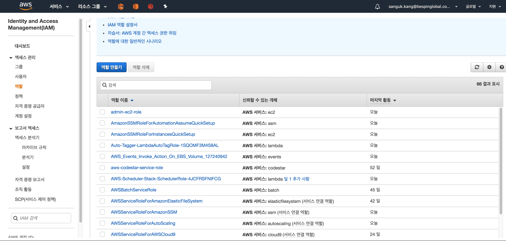
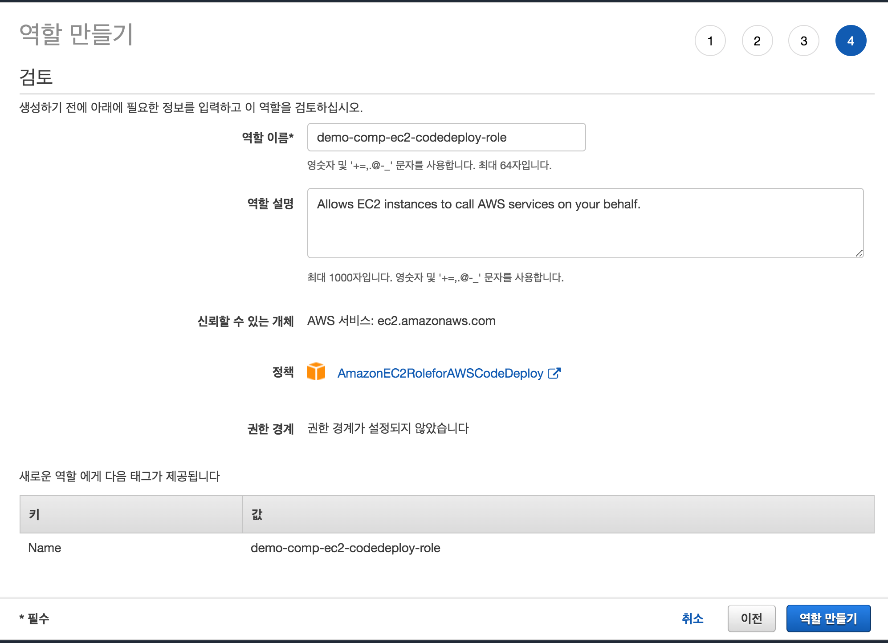

# IAM 역할 구성
Code-deploy를 사용하여 배포하기 위해서는 AWS IAM의 'EC2' 와 'CODE-DEPLOY'에 역할(Role)을 생성 합니다. 

<h3> 공통 메뉴 </h3>

IAM 역할은 IAM > 역할 > "역할 만들기"로 시작 합니다.

---

## 1. EC2 역할 생성
CodeDeploy에 의해 생성 되는 EC2는 배포 시점에 Code-Deploy Agent가 동작 하므로 Agent가 AWS 의 주요 자원(S3, EC2, lambda 등)의
액세스 권한을 필요로 합니다. 

- demo-comp-ec2-codedeploy-role(가칭) 생성 준비  

  

- AmazonEC2RoleforAWSCodeDeploy 정책 생성 

  

- 태깅 정보 기입  

  

- 검토 및 demo-comp-ec2-codedeploy-role(가칭) 역할 생성 합니다.  

---

## 2. code-deploy 역할 생성

CodeDeploy가 실행을 위해 필요한 IAM 권한 입니다. Jenkins 와 같은 CICD 툴이 CodeDeploy를 호출할 때 실행 권한을 필요로 합니다.

- demo-comp-deploy-codedeploy-role(가칭) 생성 준비    
AWS 서비스 > CodeDeploy를 선택 합니다.   
화면 하단의 "사용 사례 선택" 에서 CodeDeploy 를 선택 하고 "다음 권한"을 선택 합니다.

   

- 태깅 정보를 기입 합니다. (예시: demo-comp-deploy-codedeploy-role)

   

- 검토 및 code-deploy-role 역할을 생성 합니다.
