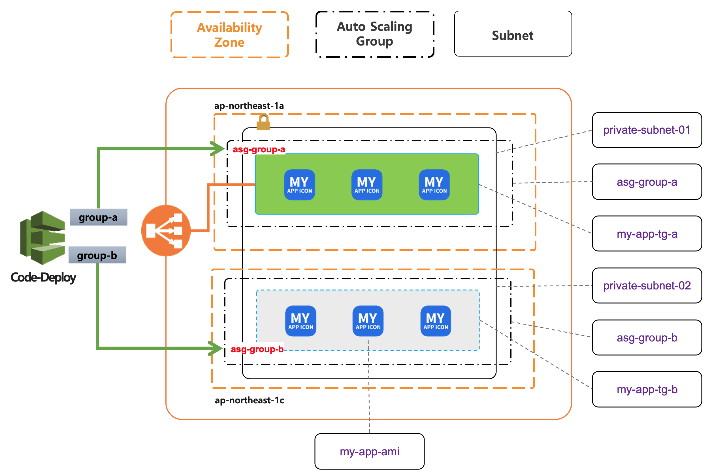

## VPC 리소스 구성 

Demo frontend 어플리케이션의 Blue/Green 배포를 위한 VPC의 주요 리소스를 구성 합니다.

---

### VPC 주요 리소스 

 리소스 타입    | 리소스 이름    | 설명 |
:----------:   | :-----------: |  :----------- |
서브 네트워크       | private-subnet-01    | target group 01의 my-app을 배치를 위한 서브넷으로 HA를 위해 AZ(ap-northeast-1a) 에 구성      | 
오토 스케일링 그룹  | asg-group-a          | CodeDeploy의 group-a 배포그룹 타겟인 auto-scaling-group “asg-group-a” (그린 영역)            |
타겟 그룹           | my-app-tg-a          | my-app-tg-a 타겟 그룹은 ALB 의 라우팅 경로로 연결된 On-Servcie 중인 서비스 그룹 (그린 영역)   |
서브 네트워크       | private-subnet-02    | target group 02의 my-app을 배치를 위한 서브넷으로 HA를 위해 AZ(ap-northeast-1c) 에 구성      |
오토 스케일링 그룹  | asg-group-b          | CodeDeploy의 group-b 배포그룹 타겟인 auto-scaling-group “asg-group-b” (블루 영역)            |
타겟 그룹           | my-app-tg-b         | CodeDeploy의 group-b 배포그룹 타겟인 auto-scaling-group “asg-group-b” (블루 영역)            |
시작 템플릿         | my-app-asg-lt       | asg-group-a, asg-group-b 오토 스케일링 그룹에서 사용 하는 ec2인스턴스 생성 및 health-frontend 를 위한 시작 템플릿 구성 |

---

### 오토 스케일 그룹

EC2 인스턴스(컴퓨팅 파워)의 탄력적인 확장 기능을 가능하게 하는 AWS 의 서비스 

주요 속성       | 설정 값 예시  | 기타
:----------:   | :-----------  | :-----------
오토 스케일명   | my-app-asg    | 
시작 템플릿     | my-app-asg-lt | 새롭게 구동되는 my-app를 위한 ec2 인스턴스 생성시 참조 하는 시작 구성 템플릿
desired        | 1             | 최초 시작에 필요한 인스턴스 수 
min            | 1             | 탄력적으로 축소 하는 경우 인스턴스의 최소 갯수 
max            | 5             | 탄력적으로 확장 하는 경우 인스턴스의 최대 갯수
vpc-id         | vpc10290124   | ASG 가 구성된 VPC 
AZ             | ap-northeast-2a, ap-northeast-2c   | HA 를 통한 가용 구성을 위해 물리적인 Data Center 설정 
target group   | my-app-tg-a   | 오토스케일의 탄력적인 확장에 의해 EC2 인스턴스가 생성 되어 서비스 되는 대상 그룹 
상태검사 유휴기간 | 300       | 오토스케일 라이프사이클의 주요 이벤트에 대해 상태 점검이 필요한 기준 시간

--- 
 
### 시작 템플릿

시작 템플릿은 EC2 인스턴스를 새롭게 구동할 때 참조 하는 OS 타입, EC2 타입, EBS Volume, 보안 그룹 등을 정의 합니다.

주요 속성       | 설정 값 예시  | 설명 
:----------:   | :-----------  | :-----------
name           | my-app-asg-lt | 
ec2-type       | m5.large      | 새롭게 구동되는 my-app를 위한 ec2 인스턴스 생성시 참조 하는 시작 구성 템플릿
ami-id         | ami-0c5a717974f63b04c | 최초 시작에 필요한 인스턴스 수 
Security Group | sg-0627eb058ca78b96c, ...  | 탄력적으로 축소 하는 경우 인스턴스의 최소 갯수 
key-pair       | prd-keypair   | 탄력적으로 확장 하는 경우 인스턴스의 최대 갯수
EBS-snapshot   | snap-0cbb59dd32bab1541   | OS 설치에 필요한 EBS 볼륨 스냅샷 
EBS Size       | 12 GB         | EBS 볼륨 크기  
Volum Type     | gp2           | SSD, HDD 등의 디스크 액세스 타입  
종료시 삭제     | Yes           |  오토스케일의 경우 자동 축소된 인스턴스에 대해 종료 하는 정책이 기본 값 
user-data      | 300           | health check를 위한 frontend 구동 등 사용자 정의 쉘 스크립트 실행시 기입

---
 
### Code-Deploy

AWS Code-Deploy를 통해 Blue/Green 배포를 구성 합니다.  

주요 속성         | 설정 값 예시  | 설명 
:----------:     | :-----------  | :-----------
애플리케이션      | my-app-code-deploy | my-app 어플리케이션을 Blue/Green 배포를 합니다.
플랫폼            | EC2/온프레미스     | 배포 대상이 EC2 인 경우
배포 유형         | 현재 위치          | "현재 위치"와 "블루 그린" 배포 두가지 유형을 제공 하지만, "현재 위치" 유형을 커스텀 하여 "블루 그린" 배포를 구성 합니다.
배포 그룹         | group-a, group-b  | 배포 그룹 하나는은 오토 스케일링 그룹을 지정할 수 있습니다. blue 와 green에 해당하는 2개의 배포 그룹이 필요 합니다.   
오토 스케일 그룹  | my-app-asg-a, my-app-asg-a  | 배포 그룹이 사용하는 오토 스케일 그룹으로 group-a 는 my-app-asg-a 으로, group-b 는 my-app-asg-a 을 사용 하는 예가 됩니다. 
  

