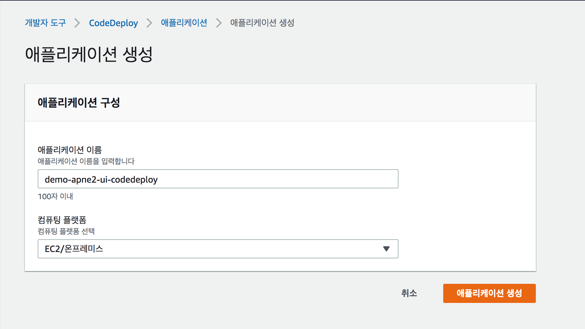
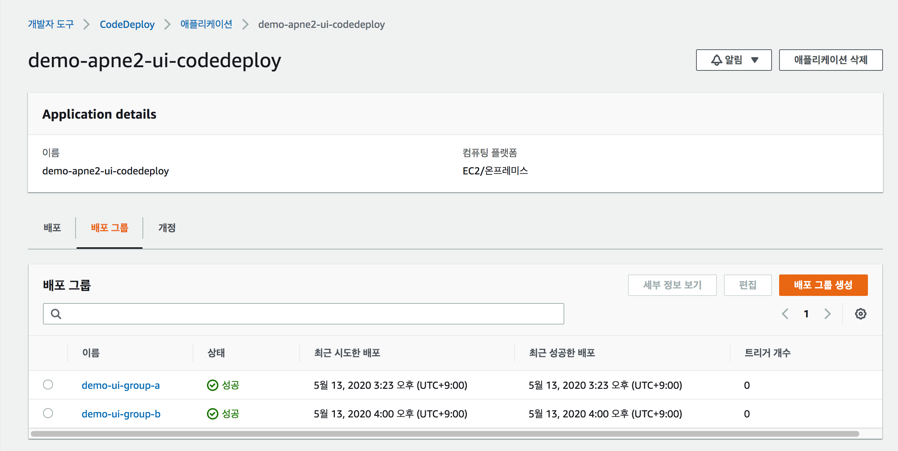

# CodeDeploy 구성
Demo 애플리케이션(demo-frontend) 배포를 위해 CodeDeploy 애플리케이션을 생성 합니다.

## 1. 구성 요소
CodeDeploy를 통한 Blue/Green 배포를 위해 다음의 과정이 필요 합니다.
> 1. CodeDeploy 애플리케이션 생성  
> 2. CodeDeploy의 배포그룹 생성 

CodeDeploy의 타겟 스테이지는 배포를 관장하는 오토스케일그룹이며 실제 로는 다음의 리소스가 연결 됩니다.

<h3>CodeDeploy 자원 구성 예시</h3> 

| 구분  | 애플리케이션    | 배포 그룹 | 오토스케일 그룹 | 타겟 그룹 | 시작 템플릿 | AMI |
| :----------: | :----------: | :-----------: | :-----------: | :-----------: | :-----------: | :-----------: |
| 블루 | demo-frontend | group-a | demo-frontend-asg-01 | demo-frontend-tg-01 | demo-frontend-lt | demo-frontend-ami | 
| 그린 | demo-frontend | group-b | demo-frontend-asg-02 | demo-frontend-tg-02 | demo-frontend-lt | demo-frontend-ami | 

dev, stg, prd 와 같이 환경이 구분 된다면 더 많은 구성 요소를 필요로 합니다.

| 구분  | 애플리케이션    | 배포 그룹 | 오토스케일 그룹 | 타겟 그룹 | 시작 템플릿 | AMI | 
| :----------: | :----------: | :-----------: | :-----------: | :-----------: | :-----------: | :-----------: | 
| dev 블루 | demo-frontend-dev | group-a | demo-frontend-dev-asg-01 | demo-frontend-dev-tg-01 | demo-frontend-lt | demo-frontend-ami |
| dev 그린 | demo-frontend-dev | group-b | demo-frontend-dev-asg-02 | demo-frontend-dev-tg-02 | demo-frontend-lt | demo-frontend-ami |
| stg 블루 | demo-frontend-stg | group-a | demo-frontend-stg-asg-01 | demo-frontend-stg-tg-01 | demo-frontend-lt | demo-frontend-ami |
| stg 그린 | demo-frontend-stg | group-b | demo-frontend-stg-asg-02 | demo-frontend-stg-tg-02 | demo-frontend-lt | demo-frontend-ami |
| prd 블루 | demo-frontend-prd | group-a | demo-frontend-prd-asg-01 | demo-frontend-prd-tg-01 | demo-frontend-lt | demo-frontend-ami |
| prd 그린 | demo-frontend-prd | group-b | demo-frontend-prd-asg-02 | demo-frontend-prd-tg-02 | demo-frontend-lt | demo-frontend-ami |

---

## 2. 애플리케이션 구성

- CodeDeploy > 배포 > 애플리케이션 메뉴의 "애플리케이션 생성" 을 통해 구성을 시작 합니다. 

 

- 애플리케이션 이름과 컴퓨팅 플랫폼을 선택하고 "애플리케이션 생성" 버튼을 클릭 합니다.  

 

---

## 3. 배포 그룹 구성

3 애플리케이션이 생성 되면 실제로 배포 진행을 관장 하는 배포 그룹을 생성 합니다.

**`중요`** Blue/Green 배포를 위해선 Blue에 대한 배포 그룹과 Green에 대한 배포 그룹 각각이 구성 되어야 합니다.

 

- 배포 그룹 생성:     
> "배포 그룹 이름"을 기입 하고 "서비스 역할"을 선택 합니다.   
> "배포 유형"에 "현재 위치"을 선택 합니다.     
> (참고로, 배포 유형은 "현재 위치"와 "블루 그린" 두 가지 유형이 있으며, Blue/Green 임에도 "현재 위치"를 선택 해야 합니다.)      
> "환경 구성"에 "오토 스케일 그룹"을 선택 합니다.     
> "배포 설정"을 "CodeDeployDefault.AllAtOne"를 선택 하고 로드 밸런서를 선택 한뒤 demo-frontend가 배치될 대상 그룹 (예: demo-frontend-tg-01)을 선택 합니다.

 

- 배포 그룹 확인
auto-scaling group(demo-frontend-dev-asg-01, demo-frontend-dev-asg-02)에 대한 그룹을 두개 생성한다.
