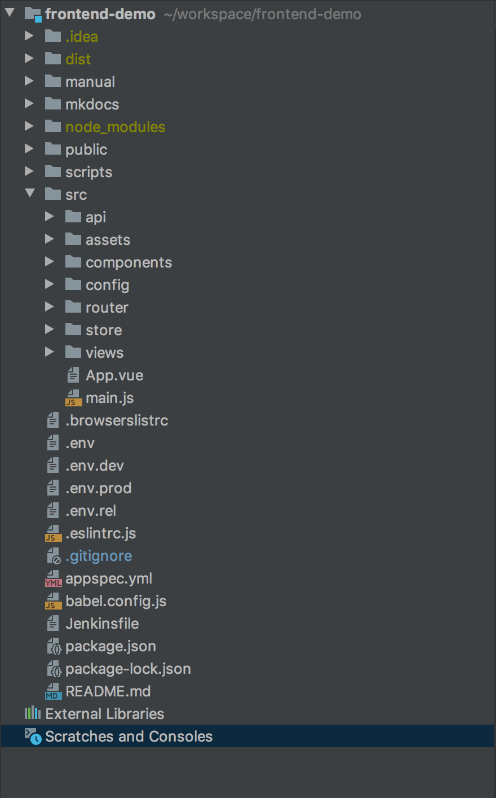

# **Directory 구조**
---
## 1. 전체 디렉토리 구조

## 2. 디렉토리 구조 설명
### 1) manual
> README.md 가이드 문서에 사용하는 메뉴얼 디렉토리
### 2) mkdocs
> mkdocs 가이드 문서를 구성하는 파일 디렉토리  
> 실행방법 :  
~~~
$ cd ~/workspace/frontend-demo/mkdocs
$ mkdocs serve
~~~
### 3) dist
> 프로젝트를 build하여 배포할때 생성되는 디렉토리

### 4) node_modules
> npm module을 모아놓은 디렉토리

### 5) public
> vue 기본 구성 폴더로 index.html파일과 favicon.ico파일 디렉토리

### 6) scripts
> CICD를 위한 codedeploy 작업을 위하여 사용하는 디렉토리

### 7) src
> 실제 프로젝트 개발에 필요한 소스 디렉토리
#### 7-1) api
> API 호출을 위한 axios 공통 적용 디렉토리
#### 7-2) assets
> 어플리케이션에 사용하는 이미지 및 css 파일 디렉토리
#### 7-3) components
> vue component 를 모아 놓은 디렉토리 (업무별 폴더 구분하여 사용)
#### 7-4) config
> 프로젝트에 사용하는 설정이 모여있는 디렉토리
#### 7-5) router
> vue-router를 설정하는 디렉토리
#### 7-6) store
> vuex 설정 디렉토리
#### 7-7) views
> vue main 화면 디렉토리 (하위 vue component와 연결)